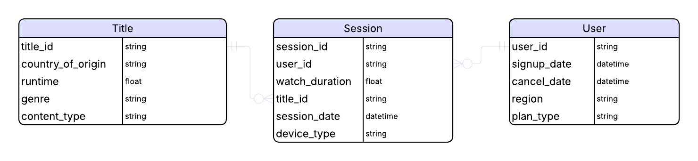
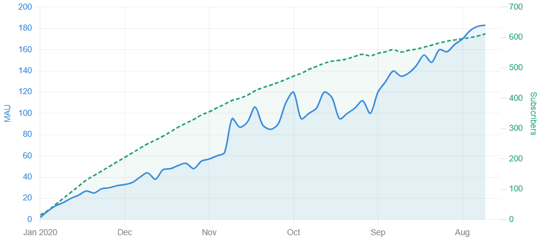
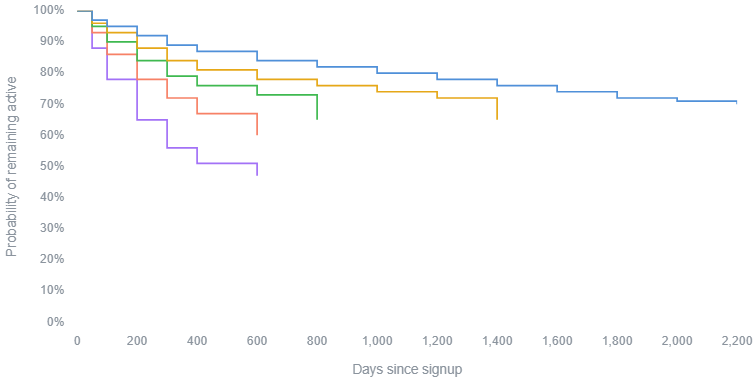
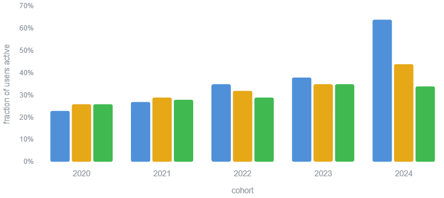
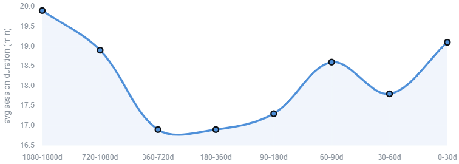
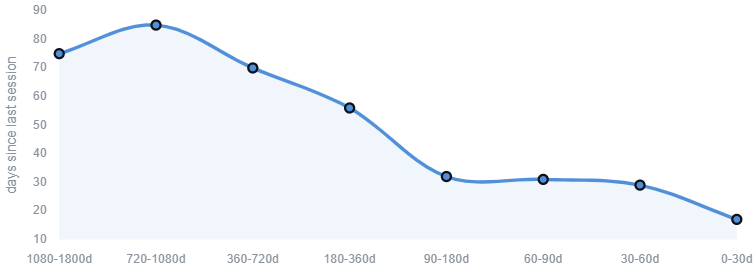

# Flixhub Engagement & Growth Performance Report

## Client Background
Flixhub is a Europe-based entertainment streaming platform positioned as an affordable alternative for film enthusiasts seeking a frequently refreshed catalog of global titles. Founded in 2020, the platform has expanded steadily over the past five years, accumulating over 1,000 users, 10,000 sessions, and more than 200 titles.

In response to recent signs of slowing growth, rising churn, and performance metrics that lag behind industry benchmarks, the Operations and Strategy teams commissioned a comprehensive five-year analysis of user behavior, engagement, retention, and content performance. The goal is to understand how the platform is evolving, identify the drivers behind recent declines, and surface actionable opportunities to improve acquisition, engagement, and long-term retention.

This analysis is guided by the following business questions:

1. How is the platform’s user base evolving over time?
2. How engaged are users, and what drives their engagement?
3. What is driving changes in retention across cohorts?
4. Are there meaningful behavioral differences across regions, plan types, or title origin?
5. What levers can the platform pull to improve growth, engagement, and retention going forward?

Key insights and recommendations are structured around three core areas:

- **Activity:** MAU trends, subscriber count, subscriber growth rate
- **Engagement:** average daily watch time, watch completion, engagement rate
- **Retention:** cohort retention rate and cohort churn rate across signup periods

## Data & Methodology

## Executive Summary

The platform has entered a maturity phase. Acquisition is plateauing and churn is rising, while engagement remains stable but static. User behavior looks remarkably uniform across regions, plans, and content types — with movies as the major driver. To reignite growth, the company needs to improve early retention and strengthen content value, especially around high-engagement formats like movies.

### 1. Early Growth to Recent Plateaus

- **The platform experienced strong early growth post-launch**, followed by a clear multi-year deceleration. Monthly active users grew rapidly after release, averaging ~9% MoM and peaking in mid-2022, but growth steadily declined thereafter, with 2024 averaging ~2% MoM and multiple months of net contraction.
- Subscriber growth has mirrored MAU trends, transitioning from expansion to stagnation. **Early subscriber growth averaged ~7% MoM in 2021, but by 2023–2024 growth slowed to ~1% or less**, including several months of negative net adds — signaling a shift from growth to maintenance.
- Importantly, **engagement intensity among remaining users has not deteriorated**. Core metrics such as average daily watch time and watch completion remain stable and seasonal, indicating that the plateau is driven by slowed acquisition and higher churn rather than declining usage among active users.

### 2. Accelerating Activation & Dropoff

- **Newer cohorts activate faster but churn significantly earlier** than prior cohorts. Time-to-first-activity has decreased year-over-year, while survival curves show materially lower retention for cohorts from 2022 onward, with 2024 exhibiting the steepest early drop-off.
- **Early engagement gains are not translating into sustained user value.** Despite faster activation, cohort retention decays more quickly within the first 1–3 months, indicating that initial interest or novelty does not convert into long-term usage.
- This pattern points to **declining user-product fit rather than engagement depth issues**. Stable engagement intensity among active users suggests churn is driven by who is acquired and expectations set at onboarding, not by how remaining users consume content.

### 3. Unexpected Churner Behavior

- **Rising churn has not been preceded by a decline in engagement intensity.** Core engagement metrics — including average daily watch time, watch completion, and sessions per active user — remain stable and largely seasonal across the period, even as cancellations accelerate.
- **Users often remain active until shortly before cancellation.** Churn does not follow a typical gradual disengagement pattern, indicating that users continue consuming content but ultimately opt out once perceived long-term value declines.
- **This disconnect suggests churn is driven by value realization rather than usage depth.** The platform retains the attention of active users in the short term, but struggles to sustain perceived value over time — pointing to issues such as content exhaustion, expectation mismatch, or insufficient reasons to remain subscribed.

### 4. Recommendations

- **Refocus acquisition toward long-term user fit, not early activation**. Given faster activation but weaker retention in newer cohorts, revisit acquisition channels, messaging, and onboarding flows to ensure expectations align with sustained platform value rather than short-term novelty.
- **Intervene earlier in the user lifecycle** to address rapid drop-off. Concentrate retention efforts within the first 30–90 days post-signup, where cohort decay is steepest, by reinforcing ongoing reasons to return (content discovery, release cadence, or value reminders).
- **Investigate drivers of perceived long-term value beyond engagement intensity**. Since core engagement metrics remain stable despite rising churn, prioritize qualitative and behavioral analyses around content exhaustion, catalog depth over time, pricing sensitivity, and renewal decision triggers.

## Insights Deep-Dive

### Platform Growth Overview

Following launch, the platform experienced strong early growth, driven by steady increases in both subscriber count and monthly active users. This period was characterized by consistent expansion and rising engagement across the user base.

Over time, however, growth momentum began to slow. While total MAU continued to increase, the rate of growth declined steadily, eventually flattening in recent periods. This shift marks a departure from the platform’s early trajectory and suggests that growth dynamics have fundamentally changed.

To better understand the source of this plateau, it is necessary to examine whether the slowdown is driven by changes in acquisition, increased churn, or differences in retention across user cohorts. The following analysis explores these questions in detail.

### Weakening Cohort Retention, Accelerating Activation & Dropoff

Taken together, these analyses show that the platform’s growth plateau is driven primarily by weakening cohort retention rather than declining acquisition. While newer users are activating more quickly than earlier cohorts, they are also churning significantly earlier, leading to faster drop-off and lower long-term retention.

This pattern suggests that recent users are able to engage with the platform initially, but are not finding sufficient ongoing value to remain active over time. As a result, growth gains from faster activation are offset—and ultimately reversed—by accelerated churn.

### Churn & Engagement Behaviors

Although retention weakened across newer cohorts, the analysis did not show a clear decline in short-term engagement before churn. Churned users remained similarly active — and in some windows even more active — than retained users when comparing session frequency and watch time in the 30, 60, and 120 days before cancellation. This suggests that churn was not primarily driven by users gradually disengaging from the platform before leaving.

Instead, churn appears to be disconnected from traditional engagement indicators. Users may still be watching content shortly before cancellation, meaning the decision to leave could be influenced by factors not captured in the available behavioral data, such as perceived content value, subscription cost, billing cycles, competitive alternatives, or dissatisfaction after completing desired content. As a result, engagement alone is not a reliable early-warning signal for churn in this dataset.

## Recommendations

Based on the analysis, the platform should shift its focus from driving faster early activation to improving long-term user fit and sustained value. Newer cohorts are activating more quickly, but they are also retaining worse and churning earlier, suggesting that early usage alone is not translating into durable engagement. Acquisition messaging, onboarding flows, and early user expectations should be reviewed to ensure that new users understand the platform’s ongoing value beyond initial content discovery.

Retention efforts should also be concentrated earlier in the user lifecycle, particularly within the first 30 to 90 days after signup. Since cohort decay appears fastest shortly after users join, the platform should test interventions such as personalized content recommendations, value reminders, onboarding follow-ups, and release-based messaging during this early window. The goal should be to reinforce reasons to return before users reach the point of cancellation.

Finally, the platform should investigate churn drivers beyond basic engagement intensity. Churned users did not show a clear decline in session duration or activity before leaving, which suggests that users may still be active shortly before cancellation. This points to possible drivers such as content exhaustion, perceived catalog depth, subscription price sensitivity, billing-cycle timing, or competitive alternatives. Future analysis should combine behavioral data with user feedback, cancellation reasons, content consumption patterns, and pricing experiments to better understand why active users still choose to leave.

| Finding                                         | What it means                                          | Recommendation                                                                       |
| ----------------------------------------------- | ------------------------------------------------------ | ------------------------------------------------------------------------------------ |
| Newer cohorts activate faster but retain worse  | Early activity is not translating into long-term value | Refocus acquisition/onboarding on long-term user fit                                 |
| Retention drops steeply in first 30–90 days     | Churn risk forms early in the lifecycle                | Intervene earlier with lifecycle messaging and content discovery                     |
| Churned users remain active before cancellation | Usage alone is not enough to explain churn             | Investigate value-based drivers like content exhaustion, pricing, and billing timing |

